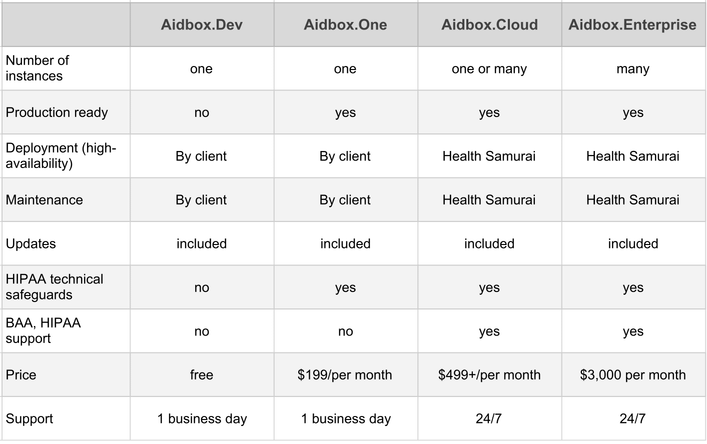

# Overview of Aidbox editions

Aidbox is an FHIR Backend-as-a-Service \(BaaS\) platform that enables deploy and integrates high available healthcare applications both on-premises and in the cloud on top of [HL7 FHIR](https://www.hl7.org/fhir/) standard. 

With Aidbox you can easily develop new healthcare products and services.  On top of the platform, you capable to build Mobile and Web Applications or integrations for existing electronic health record systems.


The FHIR standard currently describes 116 models for storing health data, and these units are called [Resources](http://www.hl7.org/fhir/resourcelist.html) \(such as Patient, Encounter, Observation, etc.\). FHIR uses a [REST API](https://hello.aidbox.io/docs/rest-api) to access and manipulate the data \(Create, Update, Search, etc\).


Aidbox is available in the following editions:

* Aidbox Dev
* Aidbox Cloud
* Aidbox One
* Aidbox Enterprise  



Aidbox.Dev is a free development environment. It is good for developers starting new healthcare projects. You can download Aidbox.Dev and set up your development environment in no time.



Aidbox.One is a one-server installation. It is good for small production installations. You can upgrade your Aidbox**.**Dev to Aidbox.One and move your solution into production.



Aidbox.Enterprise is a highly-available multi-tenant installation with 24/7 support. It is good for large enterprise installations and SaaS products.



Aidbox.Cloud is Aidbox.Enterprise in the Health Samurai cloud. It is good for everyone! Use what you need and pay for what you use.



[Aidbox](https://www.health-samurai.io/aidbox) provides you with everything you need to start building your healthcare application: 

* **FHIR storage** FHIR database schema on top of PostgreSQL that enables the use of SQL for FHIR data. Aidbox supports all major versions of FHIR: DSTU2, STU3, and R4. ****
* **Custom resources and developer-friendly extensions for FHIR resources** Not all healthcare data fits the FHIR data models. Aidbox allows adding custom resources and attributes by an easy update of metadata over RESTful API. 
* **FHIR API**   FHIR-compliant RESTful API that allows secure access and manipulation of clinical, financial and administrative healthcare data. 
* **Terminology server**  Included popular medical coding systems \(such as FHIR, ICD10, SNOMED, RxNorm, NPI\) and custom dictionaries \(ValueSets\). 
* **Security & Access Control**  Comprises OAuth 2.0, OpenID Connect and flexible security rules to control user access to healthcare application data. 
* **Subscriptions**  With the subscriptions mechanism, you can execute custom logic in your application when specific data is changing. 
* **Cloud Infrastructure**  Multi-tenant installation to a Kubernetes cluster in any public or private cloud. Aidbox handles terabytes of your healthcare data without hiccups. 
* **Add-ons**  Aidbox offers a rich ecosystem of add-ons which extend Aidbox by adding new resources and operations for specific customer needs \(e.g. Stripe integration, SMS notifications, X12 format parsing, etc.\) 
* **SDK** Integrates quickly and easily with an SDK that supports your development team's language of choice. 
* **Validation** Strict validation ensures data consistency and integrity for all FHIR resources.

