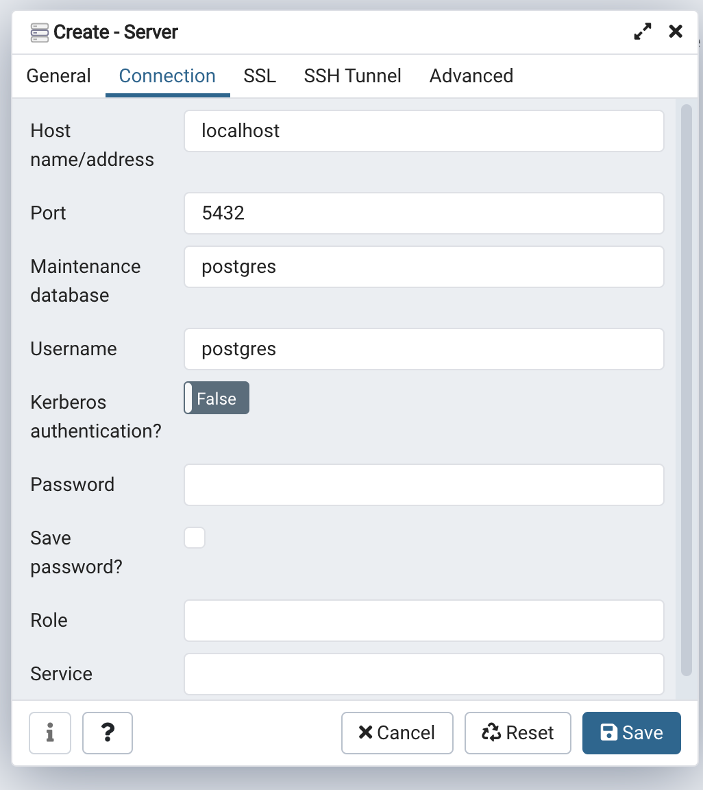
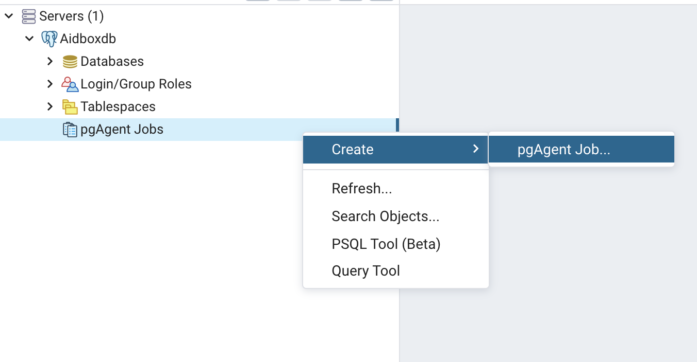

# Working with pgAgent

## Enabling `pgagent`


Supported only on `aidboxdb:13.2`




Create `docker-compose.yaml` file with the following content:


```yaml
version: '3.1'
services:
  db:
    image: "healthsamurai/aidboxdb"
    ports:
      - "5432:5432"
    volumes:
    - "./pgdata:/data"
    environment:
      POSTGRES_USER: "postgres"
      POSTGRES_PASSWORD: "postgres"
      POSTGRES_DB: "postgres"
      ENABLE_PGAGENT: "true"
```



**pgAgent** options are described [here](../../getting-started/installation/aidboxdb-image.md#optional-environment-variables).  
You can find more information about **aidboxdb** setup [here](../../getting-started/installation/aidboxdb-image.md).


Start docker container:

```bash
docker compose up --detach
```


In this example it's assumed that container name is `aidbox_db_1`.  
You can use `docker ps` to find out container name or id on  your system.


Verify that `pgagent` is working:

```bash
docker exec aidboxdb_db_1 pgrep -- pgagent
```

If `pgagent` is running, shell will respond with pid number:

```bash
$ docker exec aidboxdb_db_1 pgrep -- pgagent
55
```


It might take some time before `pgagent` process will start up.  
Try in couple of seconds if there is no response.


## Scheduling a job in pgAdmin


Refer to [https://www.pgadmin.org/](https://www.pgadmin.org/) for pgAdmin and pgAgent documentation


Create server connection  




It's important that **Maintenance database** is the database `pgagent` connected to.  
By default it's `postgres` database, you can control it with env variables, more info at [aidboxdb image docs](../../getting-started/installation/aidboxdb-image.md#optional-environment-variables).


Now you can schedule a job as described at [pgAgent docs](https://www.pgadmin.org/docs/pgadmin4/development/pgagent_jobs.html).



