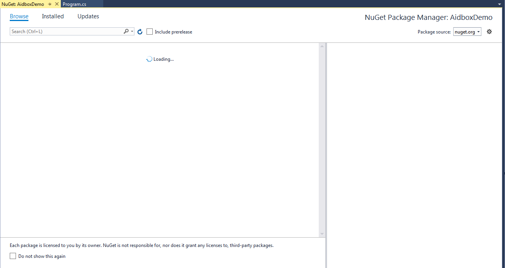
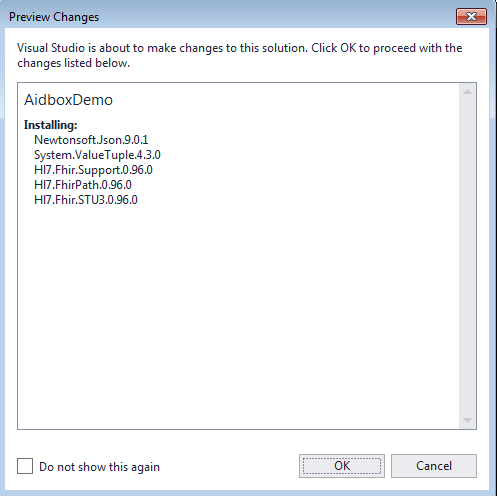

# Working with Aidbox from .NET

### Prepare the project

1. Start VisualStudio.
2. Create the project appropriate type \(for example, “Console App”\):

3. Open “Project”-&gt;”Manage NuGet Packages…”:

4. Enter in search “hl7.fhir.stu3”:

5. Click install:

6. Click “Ok”:

7. Click “I Accept”.

8. Your project is ready for working with aidbox.

### Sample project

In this [project](https://github.com/Aidbox/AidboxDemo) we create a patient in the box in aidbox via [.NET API for HL7 FHIR](https://github.com/ewoutkramer/fhir-net-api). Next we read a newly created patient from the demo box. It's important to remember that currently [Aidbox](https://www.health-samurai.io/aidbox) doesn't support XML format and we need explicitly set it to JSON.

If you build and run application, you can see something like this:  

