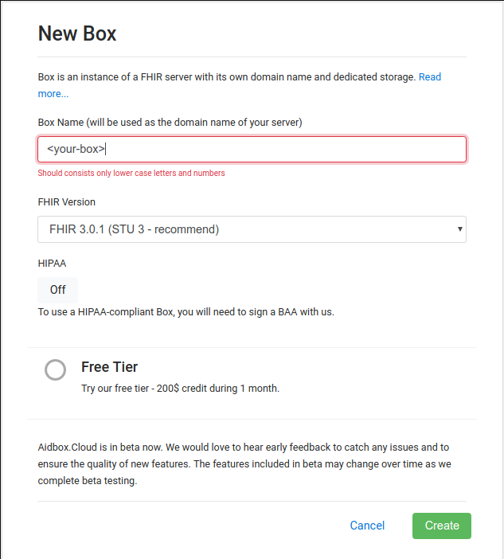
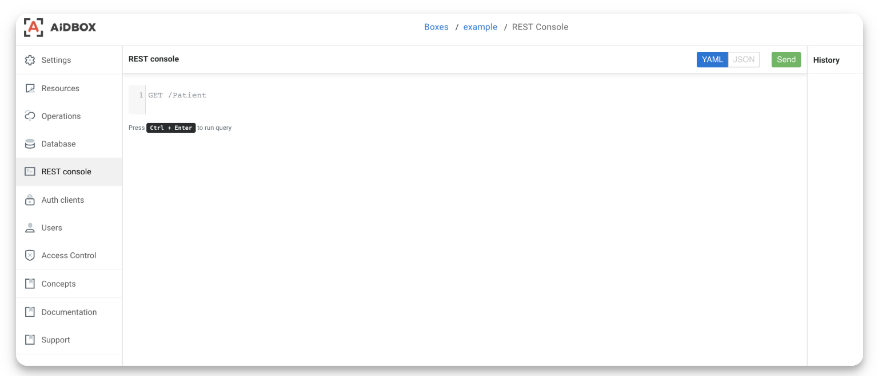

# Getting Started with SPA

After reading this guide, you will know:

* What is FHIR and SPA
* How to create an instance of FHIR server
* Create a new SPA, and connect your application to a FHIR server
* Basics of FHIR RESTful API
* How to make secure requests to FHIR server
* How to quickly generate the starting pieces of a FHIR SPA application

## Introduction

#### Basic terms

* [FHIR](https://www.hl7.org/fhir/index.html) is a platform specification that defines a set of [entities](https://www.hl7.org/fhir/resourcelist.html) and [operations](https://www.hl7.org/fhir/http.html) on those entities for interoperability between healthcare systems and applications
* [FHIR server](https://aidbox.app) is a web application implementing FHIR specification and providing RESTful API
* [SPA](https://en.wikipedia.org/wiki/Single-page_application) is a single-page application, which runs in user web browser, in our case it will be an [Angular](https://angular.io/) based project
* Box is an instance of FHIR server provided by any Aidbox product

#### Guide assumptions

This guide assumes that you already have installed git, npm, postman and have terminal application.

In this guide we will be using Aidbox.Cloud for simplicity of Box creation, but any other Aidbox product will also work.

## Create a box

Choose how you would like to authoraize [Aidbox](https://ui.aidbox.app). It can be done via your Github or Google account.


After you have been successfully authorized in [Aidbox.Cloud](https://ui.aidbox.app), click the 'New Box' button to start.


In the displayed form, enter your future box name. It can be a name of your application you are going to build, choose your plan and click 'Create' button.



Your new box was successfully created. Click the box name to proceed.


## Check the CRUD

Let's see what can we do here.



REST console is designed to work with resources on your `Box` by sending HTTP requests in accordance with [FHIR RESTful API](http://hl7.org/fhir/http.html). To do this, we need to type - a HTTP verb \(`GET`, `POST`, `PUT`, `PATCH`, `DELETE`\) and the address of the resource \(for example `/Patient` - _pay attention to the resource name with a capital letter_\), in cases when you need to send the request body \(e.g -  `POST` request\), it passed separated by empty line, in YAML or JSON format - you can choose both \(request and response\) content type by **YAML** \| JSON switcher.

### Create Patient

Let's add a couple of new patients -  for this we type in our console `POST /Patient` and in the body of the request wherein we will send the data of our new patient:



```javascript
POST /Patient

{
  "resourceType": "Patient",
  "name": [
    {
      "given": ["Max"]
    }
  ],
  "gender": "male",
  "birthDate": "1990-10-10",
  "address": [
    {
      "line": [
        "123 Oxygen St"
      ],
      "city": "Hello",
      "district": "World",
      "state": "NY",
      "postalCode": "3212"
    }
  ],
  "telecom": [
    {
      "use": "home"
    },
    {
      "system": "phone",
      "value": "(32) 8934 1234",
      "use": "work",
      "rank": 1
    }
  ]
}
```



```javascript
Status: 201

{
 "name": [
  {
   "given": [
    "Max"
   ]
  }
 ],
 "gender": "male",
 "address": [
  {
   "city": "Hello",
   "line": [
    "123 Oxygen St"
   ],
   "state": "NY",
   "district": "World",
   "postalCode": "3212"
  }
 ],
 "telecom": [
  {
   "use": "home"
  },
  {
   "use": "work",
   "rank": 1,
   "value": "(32) 8934 1234",
   "system": "phone"
  }
 ],
 "birthDate": "1990-10-10",
 "id": "f8fe69db-c01c-4a3b-bf0c-0a806ea22577",
 "resourceType": "Patient",
 "meta": {
  "lastUpdated": "2018-10-23T09:47:36.555Z",
  "versionId": "222",
  "tag": [
   {
    "system": "https://aidbox.io",
    "code": "created"
   }
  ]
 }
}
```



This is example, you can change values as you want, but better check full [Patient resource](https://www.hl7.org/fhir/patient.html) description and [official example](https://www.hl7.org/fhir/patient-example.json.html). The `id` field in the request body is not required, if you do not send it to the server, it will be generated. A description of the difference in `create` operation behavior between FHIR and Aidbox endpoints can be found [here](../basic-concepts/aidbox-vs-fhir.md).


### Get Patient

After sending the request - we receive a response with `Status: 201` and the sent data - our patient is created. We can make sure of this by sending request  `GET /Patient/<id>` and receive created patient data \(in our case id is `f8fe69db-c01c-4a3b-bf0c-0a806ea22577`\),  or we can check a complete list of patients - `GET /Patient` 



```javascript
GET /Patient/f8fe69db-c01c-4a3b-bf0c-0a806ea22577
```



```javascript
Status: 200

{
 "name": [
  {
   "given": [
    "Max"
   ]
  }
 ],
 "gender": "male",
 "address": [
  {
   "city": "Hello",
   "line": [
    "123 Oxygen St"
   ],
   "state": "NY",
   "district": "World",
   "postalCode": "3212"
  }
 ],
 "telecom": [
  {
   "use": "home"
  },
  {
   "use": "work",
   "rank": 1,
   "value": "(32) 8934 1234",
   "system": "phone"
  }
 ],
 "birthDate": "1990-10-10",
 "id": "f8fe69db-c01c-4a3b-bf0c-0a806ea22577",
 "resourceType": "Patient",
 "meta": {
  "lastUpdated": "2018-10-23T09:47:36.555Z",
  "versionId": "222",
  "tag": [
   {
    "system": "https://aidbox.io",
    "code": "created"
   }
  ]
 }
}
```



There are much more operations that can be done with server using [RESTful API](../api/), but for our case to check if everything set up properly and to get basic understanding of FHIR RESTful API  `POST` and `GET` requests are enough.

## Give access to external clients

Aidbox products support [OAuth2.0](../oauth-2.0/) authorization framework to provide ability for developers to create applications, which can interact securely with Boxes \(Aidbox FHIR server instances\). For single-page application it's a common practice to use OAuth2.0 [Implicit Grant flow](../oauth-2.0/implicit.md).

To implement this flow we need to create 3 entities:

* **User** - the person, who will login and use application
* **Client** - our single-page application, which will interact with FHIR server
* **AccessPolicy** - set of rules, which describes, who and how can access FHIR server

We will create all three entities with one request:


## Create FHIR SPA


