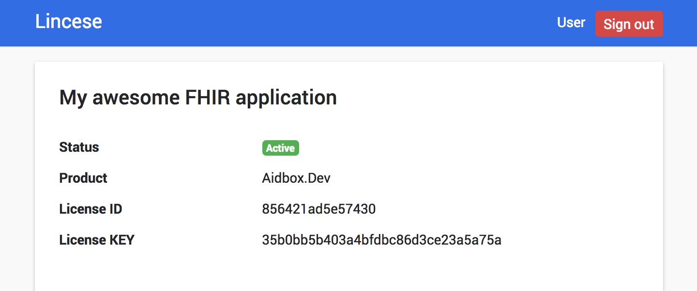
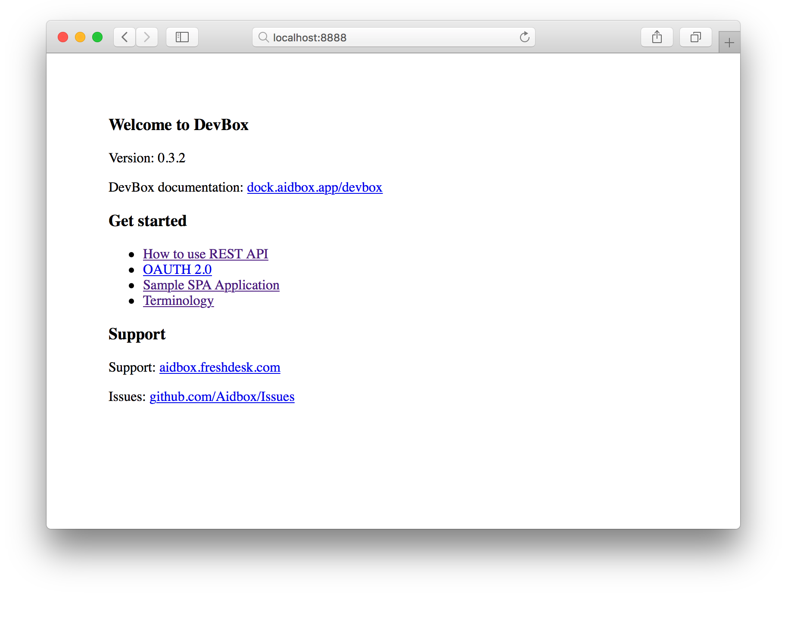

# Setup Aidbox.Dev

## Overview

We are providing a lightweight version of Aidbox named **Aidbox.Dev** — a special version aimed at local development on development computers and in your private cloud. To obtain access to Aidbox.Dev, please use our [License server](https://license-ui.aidbox.app/).

## Installation

### Requirements

* [docker](https://docs.docker.com/install/)
* [docker-compose](https://docs.docker.com/compose/install/)

### License obtaining

1. Visit and register on [License server](https://license-ui.aidbox.app) then click the `Get a license` button.


2. Enter a short description of your application and select the `Aidbox.Dev` product.


3. Congratulations, now you have a license key.



### Start Aidbox.Dev

Clone our official documentation repository with sample applications and installation instructions.

```text
$ git clone https://github.com/Aidbox/devbox.git
```

Go to the cloned directory.

```text
$ cd devbox
```

Open the `license.env` file and insert your `License ID` and `License KEY` . Or download and move your `license.env` file to the devbox root folder.



```text
DEVBOX_LICENSE_ID=856421ad5e57430
DEVBOX_LICENSE_KEY=35b0bb5b403a4bfdbc86d3ce23a5a75a
```



After that, run Aidbox.Dev.

```bash
$ docker-compose up
```

That's it! Aidbox.Dev is running and you can point your browser to [http://localhost:8888/](http://localhost:8888/) to see a fancy welcome page.



### Getting Started

Learn how to obtain access to the [REST Api](../tutorials/how-to-use-rest-api.md) by link below



## FAQ

#### How to change default FHIR version in Aidbox.Dev?

In `config/config.edn` file you can change default FHIR version. By default it `3.0.1`



```text
{:config {:logLevel :info      
          :_totalMethod :count  }
 :import {:fhir-3.0.1 {}       ;; <<<<< Default FHIR version      
          :oauth {}}}
```



Available FHIR versions: `fhir-1.0.2` `fhir-1.1.0` `fhir-1.4.0` `fhir-1.8.0` `fhir-3.0.1` `fhir-3.2.0` `fhir-3.3.0`

For example, up to 3.3.0 version:



```text
{:config {:logLevel :info      
          :_totalMethod :count }
 :import {:fhir-3.3.0 {}       ;; <<<<< Default FHIR version      
          :oauth {}}}
```




#### How to move to the latest Aidbox.Dev version?

Change  Aidbox.dev container tag in the  `docker-compose.yaml` file to `edge` tag


Be careful, edge version may be broken or unstable 




```yaml
version: '3.1'
services:
  devbox:
    image: "healthsamurai/devbox:edge"
......
```




