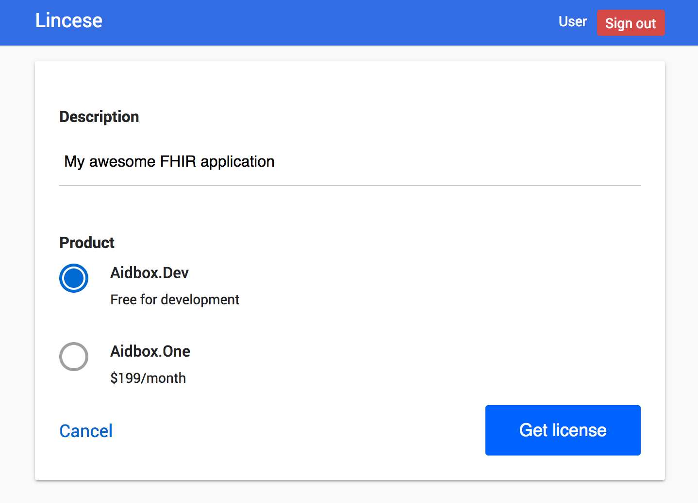

# Setup Aidbox.Dev

### Requirements

* [docker](https://docs.docker.com/install/)
* [docker-compose](https://docs.docker.com/compose/install/)

### License obtaining

1. Visit and register on [License server](https://license-ui.aidbox.app) then click the `Get a license` button.


2. Enter a short description of your application and select the `Aidbox.Dev` product.



3. Congratulations, now you have a license key.


### Start Aidbox.Dev

Clone our official documentation repository with sample applications and installation instructions.

```text
$ git clone https://github.com/Aidbox/devbox.git
```

Go to the cloned directory.

```text
$ cd devbox
```

Open the `license.env` file and insert your `License ID` and `License KEY` . Or download and move your `license.env` file to the devbox root folder.



```text
DEVBOX_LICENSE_ID=856421ad5e57430
DEVBOX_LICENSE_KEY=35b0bb5b403a4bfdbc86d3ce23a5a75a
```



After that, run Aidbox.Dev.

```bash
$ docker-compose up
```

That's it! Aidbox.Dev is running and you can point your browser to [http://localhost:8888/](http://localhost:8888/) to see a fancy welcome page.

### Getting Started

Learn how to start up with simple Single Page Application with Patient list and Patient CRUD in our tutorial.




