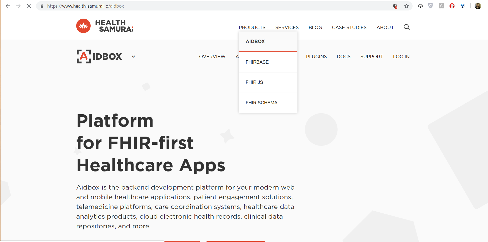
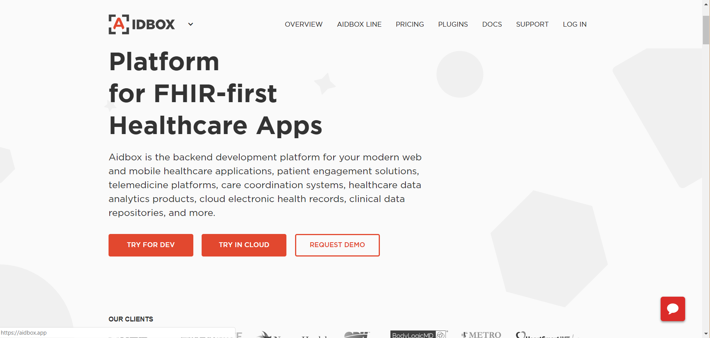
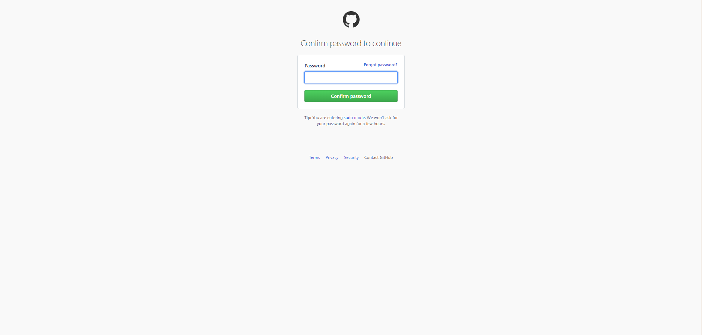
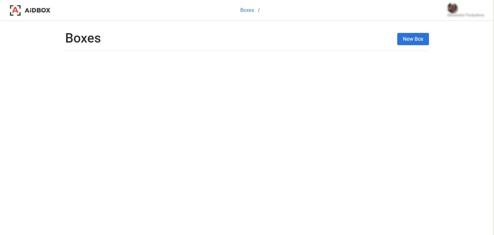
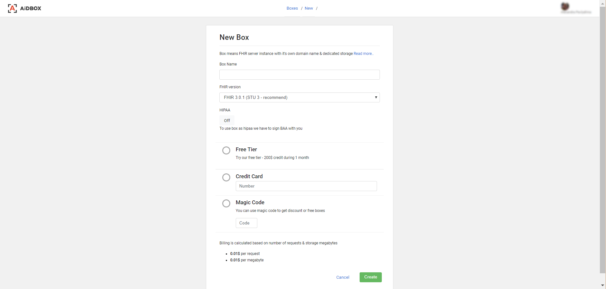
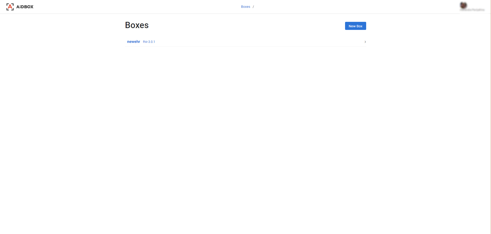
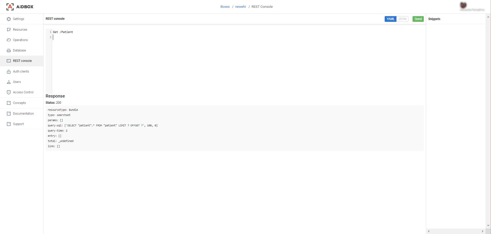

# Use Aidbox.Cloud

On the [www.health-samurai.io](www.health-samurai.io) site, select PRODUCTS/AIDBOX.

Click the 'TRY IN CLOUD' button.

Choose how you would like to authoraize Aidbox. It can be done via your Github or Google account.

If you chose Github authorization, click the 'Authorize HealthSamurai' button.

Github will ask you to confirm your password to continue.

And now you are successfully authorized in Aidbox.Cloud. Click the 'New Box' button to start.

In the displayed form, enter your future box name. It can be a name of your application you are going to build.

Choose your plan and click the 'Create' button.

Your new box was successfully created. Click the box name to proceed.

Now you can browse the left navigation menu and work with your box and its database. What you can do here: 

* Settings - view your box settings, base URL, manage your collaborators.
* Resources - view the list of available resources.
* Operations - view the list of available operations.
* Database - work with your database.
* REST console - execute REST requests to your box.
* Auth clients - manage your auth clients.
* Users - manage your box users.
* Access Control - manage access to your box.
* Concepts - view the list of available concepts.
* Documentation - redirects you to the [docs.aidbox.app](https://docs.aidbox.app) site with documentation.
* Support - modal form to send a feedback.

Let's try to execute GET request to read all Patient resources. Access the REST console, enter 'Get /Patient' and press CTRL+Enter. You will see the response.

