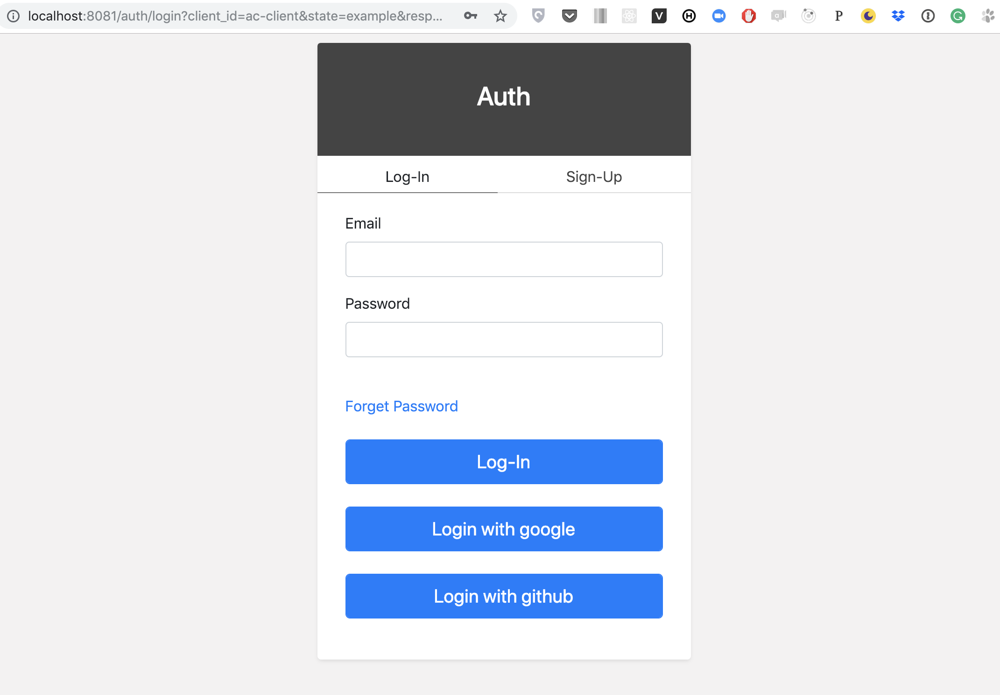

# Implicit Grant


Implicit flow is not recommened to use since there is risk of leaking access token without any comfirmation it was received by the client. More over, some servers prohibit this flow entirely. Aidbox supports Implicit Grant flow but we don't enjoyt it very much


## Description

Implicit Grant flow is an alternative for Authorization Code flow. This flow just receives `access_token` in query string fragment instead of obtaining secure`code`. It's indented for client-side apps use in order to access an API, typically as Web SPA applications. For more detailed information, read [OAuth 2.0 specification](https://tools.ietf.org/html/rfc6749#section-4.2).




Obtaining access token



a value used by the client to maintain state between the request and callback



scope of the access request



client redirect URI



client ID



value MUST be set to 

`token`



```
[redirect_uri]#access_token=YzI3ZjQ1M2MtYzFlYi00ZjI3LWI2MzgtOTQ0MWI0ZmIzZjBi&state=eyJoYXNoIjoiIy9pbXBsaWNpdC9iYXNpYyIsImZvcm0tZGF0YSI6eyJ0eXBlIjoiYmFzaWMiLCJiYXNpYyI6eyJjbGllbnQtaWQiOiJpbXAtY2xpZW50In19LCJmb3JtLXBhdGgiOiJpbXBsaWNpdC1wYWdlIn0%3D
```



After this request, the resource owner (user) will be redirected to Log-in/Sign-up page.



Next step is granting access to the client:


After granting access the user is redirected to the redirect\_uri from the client configuration with `access_token` in query string fragment.

## Example



```yaml
POST /Client
Accept: text/yaml
Content-Type: text/yaml

id: imp-client
resourceType: Client
grant_types:
- implicit
auth:
  implicit:
    redirect_uri: http://localhost:3449/auth.html
```





```bash
curl -X GET \
  'http://localhost:8081/auth/authorize?
        state=example
        &client_id=imp-client
        &redirect_uri=http%3A%2F%2Flocalhost%3A3449%2Fauth.html
        &response_type=token'
```



```
HTTP/1.1 302 Found

Location: http://localhost:3449/auth.html#access_token=ZGE0ZmQzZTYtOGU0OC00MDJhLWFkN2ItZTg5ZmViYjdmNTQ2
&state=example
```


