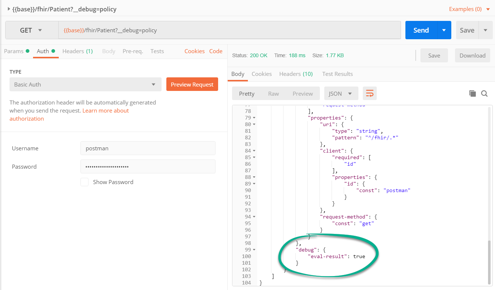
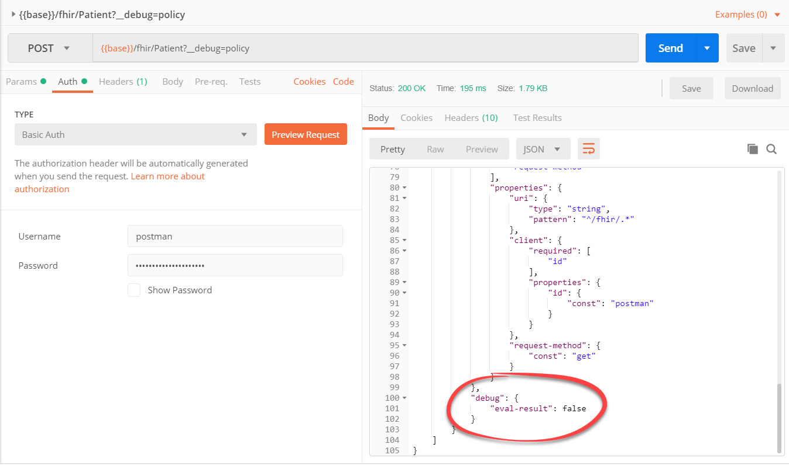

# 🎓 Access Control

## Simple Access Policy

You can test access policies with Postman.

Access the Auth Clients tab and create a new client.

```yaml
resourceType: Client
id: postman
secret: secret
grant_types: ['basic']
```

Access the Access Control tab and create new access policy with the code below. Let's consider the work of this policy. In this schema, two constraints are introduced:

1. it is allowed to use only the GET method;
2. it is allowed to use only request URIs starting with "/fhir/".

JSON-schema version:

```yaml
resourceType: AccessPolicy
id: policy-for-postman
engine: json-schema
schema:
  required:
    - client
    - uri
    - request-method
  properties:
    uri:
      type: string
      pattern: '^/fhir/.*'
    client:
      required:
        - id
      properties:
        id:
          const: postman
    request-method:
      const: get
```

Matcho engine version:

```yaml
resourceType: AccessPolicy
id: policy-for-postman
engine: matcho
matcho:
  client:
    id: postman
  uri: '#^/fhir/.*'
  request-method: get
```

Now, let's execute requests in Postman.


A request succeeds if at least one of the policies is valid for it.


### Positive Test

```javascript
GET {{base}}/fhir/Patient
```

.png>)

### Negative Test

```javascript
POST {{base}}/fhir/Patient
```

.png>)

## Policy Debugging

Let's use the parameter \_\_debug=policy in requests to see which JSON-schema validation returned true/false.

### Positive Test

```javascript
GET {{base}}/fhir/Patient
```



### Negative Test

```javascript
POST {{base}}/fhir/Patient
```



See the full documentation [Access Policies](access-control/).


[access-control](access-control/)


## Access Policies for Users

Previously, we tested access control for clients using Postman as a client. Now, let's create and test access policies for users. We will still need our client credentials.

First, we need to create a couple of users.

Access the Users tab and create two users in Aidbox.Cloud.

### User 1

```yaml
data:
  name: Camila Harrington
  roles:
    - Administrator
    - Doctor
email: user1@health-samurai.io
password: password1
id: user1
resourceType: User
```

### User 2

```yaml
data:
  name: Jazmin Holmes
  roles:
    - Patient
email: user2@health-samurai.io
password: password2
id: user2
resourceType: User
```

### Read-Only Access for Patient Role

Now, let's define read-only access for the 'Patient' role. Create an access policy with the code below.

```yaml
# matcho version
resourceType: AccessPolicy
id: policy-for-postman-users-role-patient
engine: matcho
matcho:
  user:
    data: { roles: {$contains: Patient} }
  client: { id: postman }
  request-method: get
```

```yaml
resourceType: AccessPolicy
id: policy-for-postman-users-role-patient
engine: json-schema
schema:
  required:
    - client
    - user
    - request-method
  properties:
    user:
      required:
        - data
      properties:
        data:
          required:
            - roles
          properties:
            roles:
              not:
                items:
                  not:
                    enum:
                      - Patient
              type: array
    client:
      required:
        - id
      properties:
        id:
          const: postman
    request-method:
      const: get
description: Read-only access for users with role Patient from client Postman
```

### Full Access for Administrator Role

Let's set access rights for administrators.

```yaml
# matcho version
engine: matcho
matcho:
  request-method: {$enum: ['get','post','put','delete','patch']}
  user:
    data: {roles: {$contains: 'Administrator'}}
  client: { id: postman }
```

```yaml
engine: json-schema
schema:
  required:
    - client
    - user
    - request-method
  properties:
    user:
      required:
        - data
      properties:
        data:
          required:
            - roles
          properties:
            roles:
              not:
                items:
                  not:
                    enum:
                      - Administrator
              type: array
    client:
      required:
        - id
      properties:
        id:
          const: postman
    request-method:
      enum:
        - get
        - post
        - put
        - delete
        - option
        - patch
        - head
description: Full access for users with role Administrator from client Postman
id: policy-for-postman-users-role-administrator
resourceType: AccessPolicy
```

## Test User Access Control

### Get Bearer Token for User

Now, let's test the policies in Postman.

First, we need to get bearer token for a user and a client.


This line `grant_type: password` should not be changed.


```yaml
POST {{base}}/auth/token

client_id: postman
client_secret: <your-client-password>
username: user1@health-samurai.io
password: <your-user1-password>
grant_type: password
```

Execute the request and copy the received `access_token` value. Paste it to your test request in the Authorization header with the word `Bearer` before it.

E.g. you got the access\_token:

```javascript
{
    "access_token": "45ab638d-9a3a-492b-b2df-0d8295c108fc",
    "refresh_token": "eyJzZXNzaW9uX2lkIjoiODJhYjYzOGQtOWEzYS00OTJiLWIyZGYtMGQ4Mjk1YzEwOGZjIiwidXNlcl123456InVzZXIxIiwiaWF0IjoxNTQyMDMxODkyfQpvbjE4SUxtRXhVQWJmcl8zZUVGNTZUTl9vV0E",
    "token_type": "bearer"
}
```

Your authorization header will be: `Bearer 45ab638d-9a3a-492b-b2df-0d8295c108fc`.

### Execute Requests with User Bearer Token

Now, let's execute requests from users to test their access.

Test user request with GET

```javascript
GET {{base}}/fhir/Patient?__debug=policy
```

Test user request with POST

```javascript
POST {{base}}/fhir/Patient?__debug=policy
```

The results of the schema validation should be the following:

| Request/User | User 1 (Administrator) | User 2 (Patient) |
| ------------ | ---------------------- | ---------------- |
| GET          | True                   | True             |
| POST         | True                   | False            |

See the full documentation [Resource Owner Credentials Grant](../auth/resource-owner-password.md).

## Signed RPC policy token

You can create policy-token to access rpc without creating AccessPolicy resource

To do that call `aidbox.policy/create-policy-token` RPC method:

```javascript
POST {{base}}/rpc

method: aidbox.policy/create-policy-token
params:
  expiration: 3
  methods:
    aidbox.sdc/read-document:
	  params:
	    id: doc-1
	aidbox.sdc/save-document:
	  params:
	    id: doc-1
```

This RPC method will return you a JWT token, which can be used only to call two methods with params you described:
- `aidbox.sdc/read-document`
- `aidbox.sdc/save-document`

To make a call RPC with this token just pass it in body:

```javascript
POST {{base}}/rpc

method: aidbox.sdc/read-document
params:
  id: doc-1
policy: <token from previous step>
```

