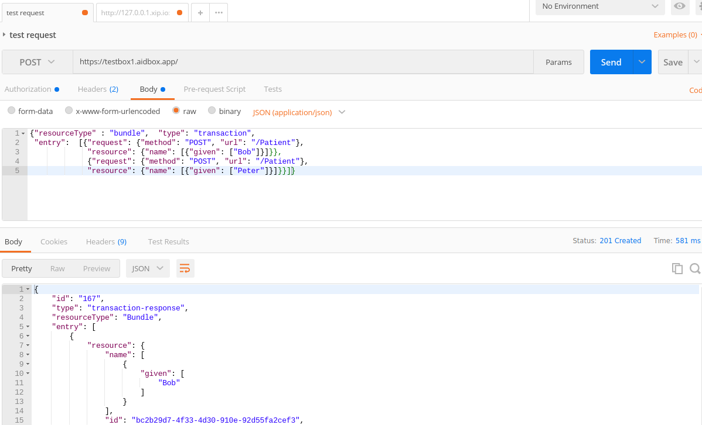

# Load bundle into FHIR server

### Create your box

Register on [https://aidbox.app](https://ui.aidbox.app/) using your Github or Google account.

Read how to register and create box in this [tutorial](create-and-configure-box.md).

Read how to setup access policies in this [tutorial](authentication-and-authorization.md).

### Access Data by REST API

Let's check that everything is working fine. Create new `GET` request, fill all required fields \(url, username, password\) in Postman or another HTTP-client, and run the query. Result should look like that picture:


### Bundle example

According to [fhir specification](https://www.hl7.org/fhir/http.html#transaction) bundle resource should look like:

```javascript
{"resourceType" : "bundle",
 "type": "transaction",
 "entry": [{"request": {"method": "GET", "url": "/Patient"}}]}
```

Every transaction bundle MUST have **type** field, which value can be **transaction** or **batch**, every entry inside MUST have **method** and **url** fields inside request map.

The bundle must be sentvia POST method to BASE\_URL, which is basically the url of your box from previous section

### Load data into Aidbox using the transaction operation

The example below demonstrates how to create two patients using one transaction request.

```javascript
{"resourceType" : "bundle", 
 "type": "transaction", 
 "entry": 
 [{"request": {"method": "POST", "url": "/Patient"},
   "resource": {"name": [{"given": ["Bob"]}]}},
   {"request": {"method": "POST", "url": "/Patient"},
   "resource": {"name": [{"given": ["Peter"]}]}}]}
```

It can be done with Postman or Aidbox user interface:



Make sure that you choose **raw** **JSON \(application/json\)** content-type.


This is a brief description about how to work with transactions and batches in Aidbox. More interesting information coming soon, stay tuned!

### Generating transaction bundle with synthea \(advanced topic\)

Here's how we can install Synthea.

```bash
git clone https://github.com/synthetichealth/synthea.git
cd synthea
./gradlew build check test
```

Edit the `src/main/resources/synthea.properties`  file to get output in the transaction bundle format:

```groovy
exporter.fhir.transaction_bundle = true
```

Generating the population one at a time...

```bash
./run_synthea -s 1000
ls output/fhir
```

...you should see two files with names similar to those:

```bash
hospitalInformation1537450368636.json 
Mckinley734_Johnston597_f25b9177-3c01-4d76-a48f-0a83affa5a56.json
```

Copy content of first file to Postman, use `BASE_URL/fhir` \(`https://testbox1.aidbox.app/fhir` for example\) as url to upload FHIR transaction bundle. Everything else is the same as in the previous step. After that, upload the content of the second file into Aidbox. That's all, you are awesome!

Read more about Synthea generator - [https://github.com/synthetichealth/synthea](https://github.com/synthetichealth/synthea).

