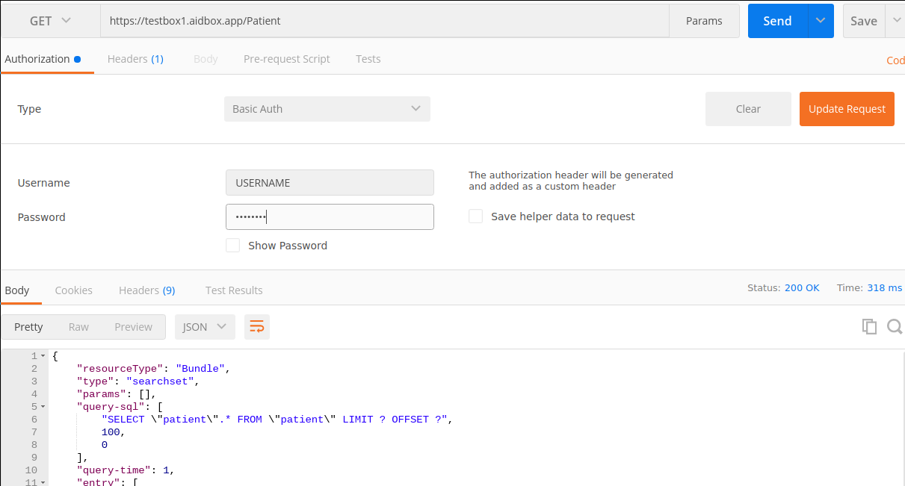

# Load bundle into aidbox.app

### Create your box

Register on https://aidbox.app using your github or google account.

Read how to register and create box in this [tutorial](create-and-configure-box.md).

### Setup Access Policy

Let's configure simple policy to access API using basic auth \(login/password\):

Open section **Auth clients**, click button **new** to create auth client and type following body for resource:

```text
resourceType: Client
id: USERNAME
secret: PASSWORD
```

 Using transaction Operation

Click `save`, open **Access Control** section, create new access policy using **new** button:  


```text
engine: json-schema
schema:
  required:
    - client
  properties:
    client:
      required:
        - id
      properties:
        id:
          constant: USERNAME
id: client1-access
resourceType: AccessPolicy
```

Now USERNAME/PASSWORD can be used to access the box via basic auth.

### Access data by REST API

Let's check that everything working fine. Create new `GET` request, fill all required fields \(url, username, password\) in postman or other http client and run the query. Result should look like that picture:



### Bundle example

According to [fhir specification](https://www.hl7.org/fhir/http.html#transaction) bundle resource should look like:

```text
{"resourceType" : "bundle",
 "type": "transaction",
 "entry": [{"request": {"method": "GET", "url": "/Patient"}}]}
```

Every transaction bundle MUST have **type** field, which value can be **transaction** or **batch**, every entry inside MUST have **method** and **url** fields inside request map.

The bundle must be sentvia POST method to BASE\_URL, which is basically the url of your box from previous section

### Load data into aidbox using transaction Operation

The example below demonstrates how to create two patients using one transaction request.

```text
{"resourceType" : "bundle", 
 "type": "transaction", 
 "entry": 
 [{"request": {"method": "POST", "url": "/Patient"},
   "resource": {"name": [{"given": ["Bob"]}]}},
   {"request": {"method": "POST", "url": "/Patient"},
   "resource": {"name": [{"given": ["Peter"]}]}}]}
```

It can be done with postman or aidbox ui:


This is a brief description about how to work with transactions and batches in aidbox. More interesting info coming soon, stay tuned!

### Generating transaction bundle with synthea \(advanced topic\)

Here how we can install synthea.

```text
git clone https://github.com/synthetichealth/synthea.git
cd synthea
./gradlew build check test
```

Edit `src/main/resources/synthea.properties` to get output in transaction bundle format:

```text
exporter.fhir.transaction_bundle = true
```

Generating the population one at a time...

```text
./run_synthea -s 1000
ls output/fhir
```

You should see two files with names similar to those:

```text
hospitalInformation1537450368636.json 
Mckinley734_Johnston597_f25b9177-3c01-4d76-a48f-0a83affa5a56.json
```

Copy content of first file to postman, use `BASE_URL/fhir` \(`https://testbox1.aidbox.app/fhir` for example\) as url to upload fhir transaction bundle. Everything else is the same as in the previous step. After that, upload the content of the second file into aidbox. That's all, you are awesome!

Read more about synthea generator - [https://github.com/synthetichealth/synthea](https://github.com/synthetichealth/synthea)

